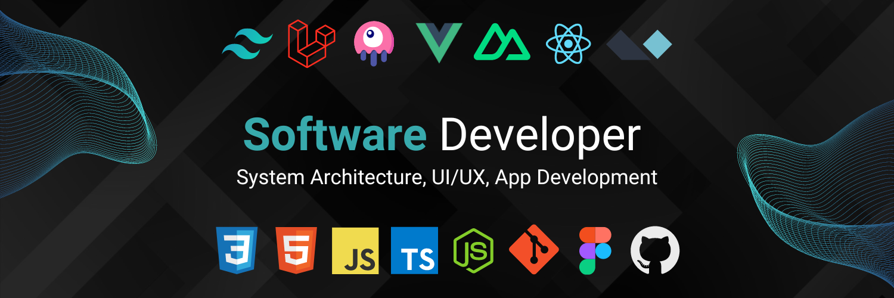

Based in Victoria, Australia, my professional journey in software development spans over a decade, enriched by a diverse portfolio of projects and technologies. After moving to non-technical management & business development roles, then dedicated period of professional development, I am back at the keyboard writing lines of code & loving it!

### What I Do

I bring to the table proficiency in a range of technologies and methodologies:
- **Core Technologies:** Adept in HTML5, CSS3, JavaScript, PHP, MySQL
- **Advanced:** Proficient in TDD, REST, GraphQL, Redis, Docker, CI/CD, Git, Agile and DevOps methodologies.

My full-stack programming capabilities are complemented by comprehensive project management skills. I manage the entire project lifecycle with a strategic perspective, ensuring that technical solutions meet complex business requirements. Everything from scope development and requirements gathering to translating business needs into technical specifications and server management.

### Projects and Collaborations

I've enjoyed working with and contributing to Open Source, and currently engaging on projects like [Pinkary](#https://pinkary.com) with Nuno Maduro.
Throughout my time I have handled numerous client projects from inception to deployment. My experience also spans maintaining and upgrading legacy codebases, often transitioning them to modern frameworks.

Since focusing on the Laravel ecosystem and working with ssociated technologies like Livewire, InertiaJs, NuxtJs, VueJS, AlpineJS, and TailwindCSS over the past several years, I've deepened my expertise in producing high-quality, robust applications by utilising modern frameworks in the process as the basis of the work.

### My Passion

Automation and system integration fuel my enthusiasm. I thrive on building decoupled modular architectures, designing RESTful APIs, and crafting scalable systems that address complex business challenges. My goal across all my work is to leverage my skills to create innovative scalable solutions, that deliver unique value to users, providing them with seamless digital experiences

### Community and Contributions

I'm committed to giving back to the community through mentoring and contributing to open source projects. I believe in sharing knowledge and fostering a collaborative environment in the software development realm.

### Let's Connect!

Although I'm currently freelancing and dedicating time to personal projects, I am actively seeking new opportunities. If you're interested in collaborating, need a project quote, or require assistance, feel free to reach out. Let's create something amazing together!

[Send me a message](mailto:cam@panr.app) | [LinkedIn](https://www.linkedin.com/in/cameron-kemshal-bell-abb72b31/) | [Twitter/X](https://twitter.com/CamKemDev)
