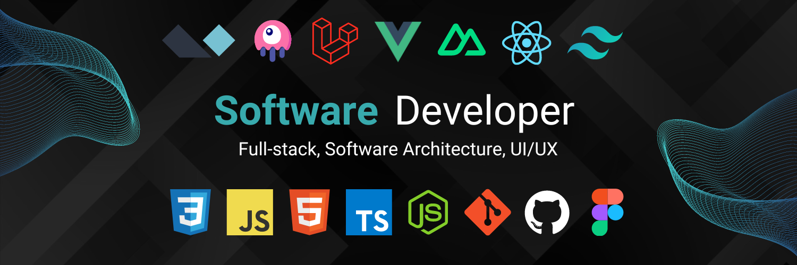

Based in Victoria, Australia, my professional journey in software development spans over a decade, enriched by a diverse portfolio of projects and technologies. Along with software development, I have experience accross the technical fields of engineering & telecommunications, in Sales, Management & Business Development, Management. After some life changes and a dedicated period of professional development, I am back in software, at the keyboard writing lines of code & loving it!

### What I Do

I am proficient in a range of estabished & emerging technologies and metholodies in the web development space.
- **Advanced:** Proficient in TDD, REST, GraphQL, Redis, Docker, CI/CD, Git, Agile and DevOps methodologies.

- **Core Languages:** Adept in HTML5, CSS3, JavaScript, PHP, SQL.
- **Advanced Tooling:** Proficient in:
  - Build Steps: Supporting Minification, Obvuscation & creating production read code.
  - Code Quality: Linting, Automated Refactoring
  - Testing: Unit, Integration and Automated End to End.
- **Modern Techologies** Knowledge of RESTful Architecure, GraphQL, Containerisation, TDD, Serverless Architecture.
- **CI/CD methologies** Utilisation of Git, Agile, DevOps, 
- **Database Expertise:** Extensive experience with RDBMS such as MySQL and PostgreSQL, including extensions like pgvector and PostGIS, as well as NoSQL technologies like Redis and MongoDB.

My full-stack programming capabilities are complemented by comprehensive project management skills. I comfortable with working as part of a team, or management the entire project lifecycle with a strategic perspective, ensuring that technical solutions meet complex business requirements. Everything from scope development and requirements gathering to translating business needs into technical specifications and server management.

### Projects and Collaborations

I've enjoyed working with and contributing to Open Source, and currently engaging on projects like [Pinkary](#https://pinkary.com) with Nuno Maduro and other prominent community members.

Where time and circumstances permit, I ejnoy providing mentorship to developers. Anything from help and assistance with coding problems to discussions around more complex software architecture, or working with them on how they can be a successful as freelance developer or product founder.

Throughout my time I have handled numerous client projects from inception to deployment. My experience also spans maintaining and upgrading legacy codebases, often transitioning them to modern frameworks.

Since focusing on the Laravel ecosystem and working with associated technologies like Livewire, InertiaJs, NuxtJs, VueJS, AlpineJS, and TailwindCSS over the past several years, I've deepened my expertise in producing high-quality, robust applications by utilising modern frameworks in the process utilising this tech as the basis of the work.

### My Passion

Any challenge that allows me to apply my skills to produce elegant solutions provides me with drive and enthusiasm. I enjoy working in automation and sytstems integration, building decoupled modular architectures, designing RESTful APIs, and crafting scalable systems that address complex business challenges. My goal across all my work is to leverage my skills to create innovative scalable products, that deliver unique value to users, providing them with seamless digital experiences.

### Let's Connect!

Although I'm currently freelancing and dedicating time to personal projects, I am actively seeking new opportunities. If you're interested in collaborating, need a project quote, or require assistance, feel free to reach out. Let's create something amazing together!

[Send me a message](mailto:cam@iterated.tech) | [LinkedIn](https://www.linkedin.com/in/cameron-kemshal-bell-abb72b31/) | [Twitter/X](https://twitter.com/CamKemDev)
