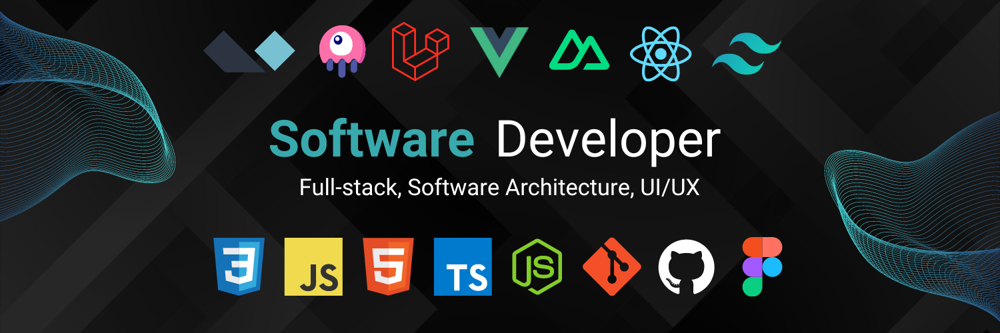

# Hey, I'm Cam 👋
Lead Engineer, open source enthusiast, software architect, and someone who still genuinely enjoys sitting down and writing code.
I'm based in Victoria, Australia and have spent much of my career building software, solving technical problems, leading projects, and helping teams deliver better products. My background spans software development, telecommunications, engineering, management, and business, which means I tend to approach problems from both the technical and human sides.
Today I work as a Lead Engineer in the health and wellbeing space, helping build products that make a genuine difference to people's lives. Alongside my day job, I continue to contribute to open source, mentor developers, explore emerging technologies, and run my own consulting work through Iterated Tech.
Despite moving into leadership and architecture work, I still love being hands-on. You'll usually find me somewhere between a pull request, a whiteboard diagram, a queue worker, and whatever new AI tooling everyone is arguing about this week.
---
## Currently
- 🏥 Lead Engineer building digital health platforms.
- 🧠 Exploring AI-assisted software development workflows.
- ❤️ Contributing to open source where time permits.
- ☕ Mentoring developers and helping teams grow.
- 🚀 Running Iterated Tech alongside my engineering work.
---
## What I Enjoy Building
I enjoy solving difficult problems and building systems that are simple to work with, easy to maintain, and able to grow over time.
Some areas I particularly enjoy:
- Application architecture and system design.
- APIs and systems integration.
- Modular applications and domain-driven design.
- Automation and developer tooling.
- Performance and scalability.
- Cloud infrastructure and DevOps.
- Developer experience.
- AI-assisted engineering workflows.
- Health technology.
I particularly enjoy taking complex business problems and turning them into practical software solutions.
---
## Building Things With
I spend less time worrying about specific technologies these days and more time thinking about how teams build software, how systems evolve over time, and how technology solves real problems.
Most of my work sits somewhere between application architecture, product engineering, developer experience, AI-assisted workflows, and helping teams build maintainable software that can grow with the business.
I still enjoy writing code every day, but these days I'm just as likely to be found reviewing architecture, mentoring developers, designing systems, or experimenting with whatever new tooling the industry is excited about this week.
---
## Open Source
Open source has played a huge part in my journey.
I've learned an enormous amount from the Laravel and PHP communities over the years and enjoy giving back wherever I can. I've contributed to projects, helped developers solve problems, mentored people entering the industry, and participated in community projects such as [Pinkary](https://pinkary.com).
I still believe some of the best software is built by people sharing ideas, sharing knowledge, and helping each other improve.
### GitHub
- Personal: https://github.com/camkb85
- Work: https://github.com/CamKemBell
---
## Iterated Tech
Alongside my engineering role, I run **Iterated Tech**.
The goal is simple: help businesses make better technology decisions.
That might involve:
- AI adoption and human-in-the-loop workflows.
- Software architecture reviews.
- Technical strategy.
- Engineering process improvement.
- Application modernisation.
- Developer productivity and tooling.
- Technical leadership and mentoring.
I'm particularly interested in how AI can augment software teams rather than replace them.
---
## Outside of Work
I enjoy mentoring developers, discussing software architecture, exploring new technologies, and helping people solve difficult technical problems.
Whether that's helping somebody debug their first Laravel application, reviewing an architecture proposal, discussing engineering leadership, or experimenting with new AI tools, I genuinely enjoy being part of the software community.
---
## Let's Connect
[Send me a message](mailto:cam@iterated.tech) |
[LinkedIn](https://www.linkedin.com/in/cameron-kemshal-bell-abb72b31/) |
[Twitter/X](https://twitter.com/CamKemDev)